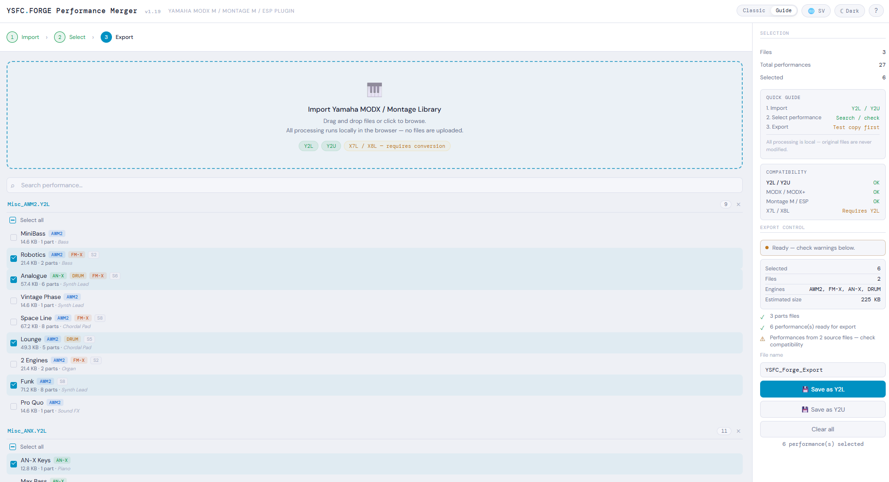
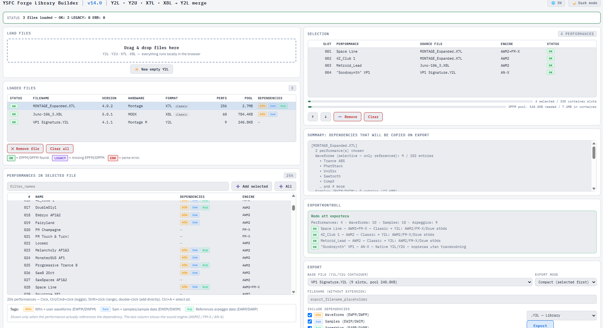

# YSFC Forge

> 🇸🇪 **Svenska:** [README_sv.md](README_sv.md)

**Open-source browser-based tools for Yamaha MODX M / ESP Plugin / Montage M performance files.**

Reverse-engineered from scratch through binary analysis of Yamaha's undocumented `.Y2L` / `.Y2U` file format. Open the HTML files in any modern browser — no installation, no cloud upload, everything runs locally.

---

## Table of Contents

* [Features](#features)
* [Quick Start](#quick-start)
* [Tools](#tools)
* [Status](#status)
* [Documentation](#documentation)
* [Contributing](#contributing)
* [License](#license)

---

## Features

* **Merge** performances from multiple `.Y2L` / `.Y2U` files
* **Edit** FM-X, AWM2, AN-X and Drum parameters in the browser
* **Translate** patches from DIVA, Vital and Synth1 to Yamaha format
* **No installation** — works in Chrome, Firefox and Safari
* **No telemetry** — everything runs locally

---

## Quick Start

### Merge performances

1. Download [`tools/ysfc_forge_performance_merger_v1_19.html`](tools/ysfc_forge_performance_merger_v1_19.html)
2. Open it in your browser
3. Drag and drop `.Y2L` or `.Y2U` files
4. Select the performances you want
5. Click **Save as Y2L** or **Save as Y2U**
6. Import the exported file in MODX M / ESP plugin / Montage M

### Merge performances including dependencies

1. Download [`tools/yysfc_forge_library_builder_v13_17.html`](tools/ysfc_forge_library_builder_v13_17.html)
2. Open it in your browser
3. Drag and drop `.Y2L` or `.Y2U` files
4. Select the performances you want
5. Click **Save as Y2L** or **Save as Y2U**
6. Import the exported file in MODX M / ESP plugin / Montage M

### Edit a performance

1. Download [`tools/ysfc_forge_performance_editor_v5_1.html`](tools/ysfc_forge_performance_editor_v5_1.html)
2. Open it in your browser
3. Click **Open Y2L** and choose a file
4. Adjust parameters with sliders
5. Click **Export Y2L** to save

---

## Tools

### Core Tools

|Tool|What it does|
|-|-|
|[**Performance Merger**](tools/ysfc_forge_performance_merger_v1_19.html)|Merge performances from multiple Y2L/Y2U files|
|[**Library Builder**](tools/ysfc_forge_library_builder_v13_17.html)|Prototype library builder (merge performances from multiple Y2L/Y2U files including dependencies)|
|[**Performance Editor**](tools/ysfc_forge_performance_editor_v5_1.html)|Edit FM-X, AWM2 and AN-X parameters in the browser|

### Translators

|Tool|What it does|
|-|-|
|[**DIVA Patch Translator**](translators/ysfc_diva_h2p_converter_v2_15.html)|Convert DIVA patches to Y2L/Y2U|
|[**Vital Patch Translator**](translators/ysfc_vital_converter_v4_12.html)|Convert Vital patches to Y2L/Y2U|
|[**Synth1 Patch Translator**](translators/ysfc_synth1_converter_v5_12.html)|Convert Synth1 patches to Y2L/Y2U|

### Utilities

|Tool|What it does|
|-|-|
|[**Smart Name Compressor**](utilities/ysfc_smart_name_compressor.html)|Standardized naming for performances|
|[**Synth Converter**](utilities/ysfc_synth_converter.html)|Convert patches between 8+ formats|

### Screenshots

||||
|-|-|-|
||||
|*Performance Editor — FM-X operator editor*|*Library Builder — performance list with engine detection*|*DIVA Patch Translator — Convert DIVA patches to Y2L/Y2U*|

---

## Status

All four synthesizer engines are **100% binary-verified mapped** through systematic A/B diff analysis on real MODX M hardware.

|Engine|UI fields|Internal/firmware|Status|
|-|-:|-:|-|
|**AWM2**|128|8|✅ 100%|
|**AN-X**|171|458|✅ 100%|
|**FM-X**|141|863|✅ 100%|
|**Drum**|54|4934|✅ 100%|

### Supported file types

|Type|Description|Support|
|-|-|-|
|`.Y2L`|Library file|✅|
|`.Y2U`|User file (identical to Y2L, just different extension)|✅|
|**Multi/GM 16-part**|16 parts (15 AWM2 + 1 Drum on Part 10)|✅|

### Hardware compatibility

|Hardware|Support|
|-|-|
|MODX M|✅ Primary target|
|ESP plugin|✅|
|Montage M|⚠️ Likely compatible — not fully tested|
|MODX (non-M)|❌ Different format|

### Test corpus

**2010+ binary-verified test files** generated through systematic parameter changes on real MODX M hardware. Every documented offset is backed by at least one A/B binary diff.

|Engine|Files|
|-|-:|
|AN-X|799|
|AWM2|408|
|FM-X|425|
|Drum|84|
|Other|294|

See [`docs/REVERSE_ENGINEERING.md`](docs/REVERSE_ENGINEERING.md) for detailed methodology, coverage tables and field-level documentation.

---

## Documentation

|Document|Contents|
|-|-|
|[`docs/REVERSE_ENGINEERING.md`](docs/REVERSE_ENGINEERING.md)|Methodology, coverage tables, technical highlights|
|[`docs/YSFC_FORGE_REFERENCE.md`](docs/YSFC_FORGE_REFERENCE.md)|Compact reference manual|
|[`docs/YSFC_FORGE_FULL_CONTEXT.md`](docs/YSFC_FORGE_FULL_CONTEXT.md)|Complete technical reference (all field positions, evidence)|
|[`serializer/ysfc_serializer.py`](serializer/ysfc_serializer.py)|Python parameter constants — useful if you want to build your own tools|

### Verification levels

Throughout the documentation, fields are rated by evidence:

* **★★★★★** — Binary-verified with one or more test files
* **★★★★☆** — Derived from official source data, highly confident
* **★★★☆☆** — Likely correct, not binary-verified
* **[INTERN]** — MODX-internal firmware constant, not user-editable

---

## Known Limitations

* **Performance Editor** currently shows only the first part's engine; full 16-part editing is on the roadmap
* **Smart Morph** interpolation tables are not yet mapped
* **Scene snapshots** — structure verified, but only \~10 fields per scene have UI-confirmed mappings
* **Patch translators** are approximations — the source synths use fundamentally different synthesis engines, so output is a starting point for sound design rather than a literal port
* **No undo/redo** in Performance Editor yet — keep backups of your originals

See [`docs/REVERSE_ENGINEERING.md`](docs/REVERSE_ENGINEERING.md) for the full list.

---

## Contributing

Bug reports, test files and reverse engineering findings are very welcome.

* **Bug reports** — see [`.github/ISSUE_TEMPLATE/bug_report.md`](.github/ISSUE_TEMPLATE/bug_report.md)
* **Reverse engineering contributions** — see [`CONTRIBUTING.md`](CONTRIBUTING.md) for the methodology
* **Feature requests** — see [`.github/ISSUE_TEMPLATE/feature_request.md`](.github/ISSUE_TEMPLATE/feature_request.md)

The most valuable contributions right now: test files for Smart Morph, Scene snapshots, and verification on real Montage M hardware.

---

## Disclaimer

This project is not affiliated with, endorsed by, or sponsored by Yamaha Corporation. MODX M, ESP plugin, Montage M and related product names are trademarks of Yamaha Corporation. The file format was reverse-engineered for interoperability purposes. Use at your own risk and always keep backups of your original files.

---

## License

MIT — see [LICENSE](LICENSE)

