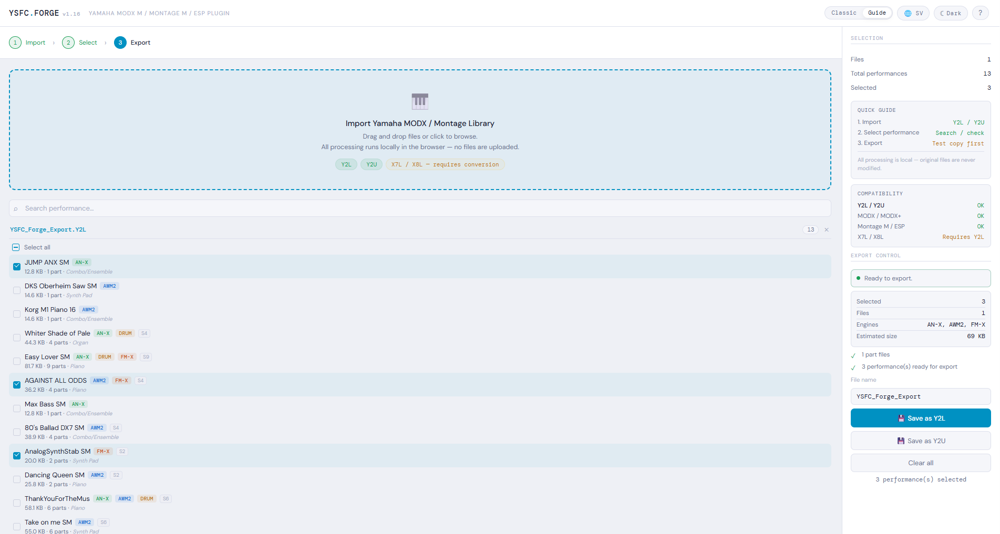
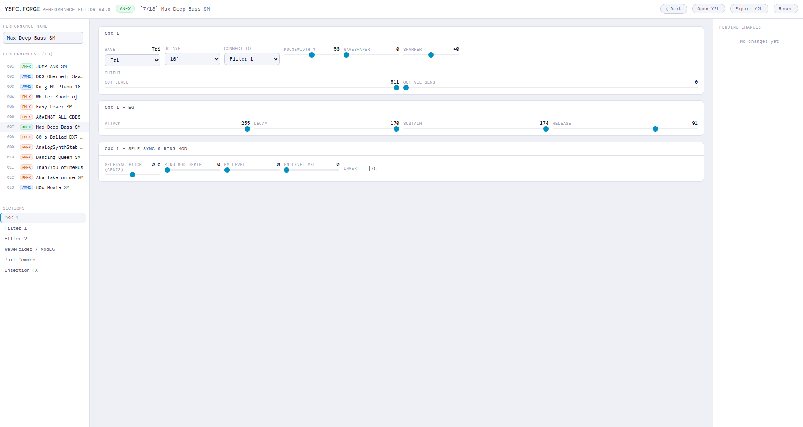
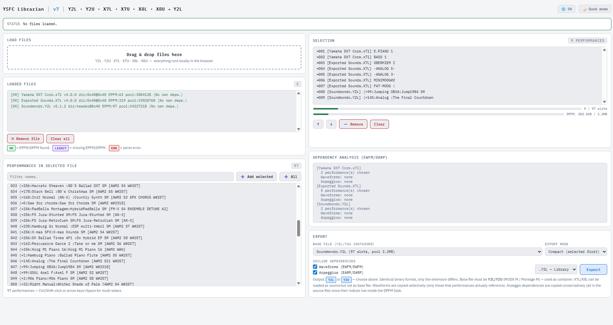
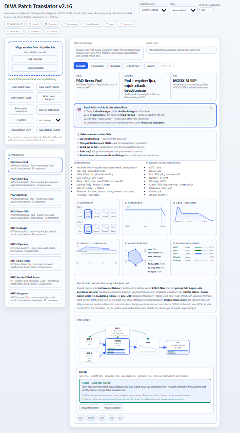

# YSFC Forge

**Webbläsarbaserade verktyg för Yamaha MODX M / ESP Plugin / Montage M-performancefiler — ingen installation krävs.**

Reverse-engineerade verktyg för Yamaha MODX M / ESP Plugin / Montage M-performancefiler.

**Byggda från grunden genom binäranalys av Yamahas odokumenterade filformat.**

Öppna HTML-filerna i vilken modern webbläsare som helst. Dra, släpp, sammanfoga, redigera och exportera `.Y2L` / `.Y2U`-filer direkt på din maskin. Inget laddas upp någonstans.

---

## Verktyg

| Verktyg | Fil | Vad det gör |
|---------|-----|-------------|
| **Forge Librarian** | `tools/ysfc_forge_v1.19.html` | Sammanfoga performances från flera Y2L/Y2U-filer till en export |
| **Performance Editor** | `tools/ysfc_performance_editor_v3.html` | Redigera FM-X, AWM2 och AN-X-parametrar direkt i webbläsaren |
| **ESP Librarian** | `utilities/ysfc_esp_librarian_v7.html` | Fristående prototyp för att sammanfoga performances |
| **Smart Performance Name Compressor** | `utilities/ysfc_smart_name_compressor.html` | Fristående prototyp för standardiserad namngivning av Yamaha MODX M-performances |
| **Synth Converter** | `utilities/ysfc_synth_converter.html` | Konvertera DIVA-, Vital- och Synth1-patches mellan olika format (8+) |
| **DIVA Patch Translator** | `translators/ysfc_diva_h2p_converter_v2_15.html` | Lär dig om DIVA-patches och konvertera DIVA-patches till Y2L/Y2U och läs in dem i Yamaha MODX M / ESP Plugin / Montage M |
| **Vital Patch Translator** | `translators/ysfc_vital_converter_v4_12.html` | Lär dig om Vital-patches och konvertera Vital-patches till Y2L/Y2U och läs in dem i Yamaha MODX M / ESP Plugin / Montage M |
| **Synth1 Patch Translator** | `translators/ysfc_synth1_converter_v5_12.html` | Lär dig om Synth1-patches och konvertera Synth1-patches till Y2L/Y2U och läs in dem i Yamaha MODX M / ESP Plugin / Montage M |

> **Ingen installation.** Ladda ner en HTML-fil, öppna den i Chrome, Firefox eller Safari och börja arbeta.

---

## Skärmdumpar

<!-- Lägg till dina skärmdumpar här -->
*Forge Librarian — dra och släpp Y2L-filer, välj performances, exportera*


*Performance Editor — FM-X operatorredigerare med algoritmdiagram*


*ESP Librarian — performancelista med engine-detektering och beroendesammanfattning*


*DIVA Patch Translator — Konvertera DIVA patches to Y2L + andra filformat (se också Vital Patch Translator and Synth1 Patch Translator)*


---

## Snabbstart

### Sammanfoga performances från flera filer
1. Ladda ner `tools/ysfc_forge_v1.19.html`
2. Öppna den i din webbläsare
3. Dra och släpp dina `.Y2L`- eller `.Y2U`-filer
4. Välj de performances du vill ha
5. Klicka på **Save as Y2L** eller **Save as Y2U**
6. Importera den exporterade filen i MODX M / Montage M

### Redigera en performance
1. Ladda ner `tools/ysfc_performance_editor_v3.html`
2. Öppna den i din webbläsare
3. Klicka på **Open Y2L** och välj en fil
4. Välj en sektion i vänsterpanelen (operatorer, filter, LFO, osv.)
5. Justera parametrar med reglage
6. Klicka på **Export Y2L** för att spara

---

## Hårdvara och format som stöds

| | Stöd |
|-|------|
| MODX M | ✅ Primärt mål |
| ESP plugin | ✅ |
| Montage M | Troligen kompatibel — inte fullt testad |
| `.Y2L` (biblioteksfil) | ✅ |
| `.Y2U` (användafil) | ✅ Identiskt binärformat — bara filändelsen skiljer sig |
| `.X7L` / `.X8L` | ✅ Som källfil för sammanfogning (inte som exportbehållare) |

### Engines
| Engine | Librarian | Patch Editor |
|--------|-----------|--------------|
| FM-X | ✅ | ✅ Alla 8 operatorer, algoritm, PEG, LFO, Filter, FM Color |
| AWM2 | ✅ | ✅ Element, filter, AEG, waveformnummer |
| AN-X | ✅ | ✅ OSC, Filter 1/2, WaveFolder, ModEG |
| DRUM | Detekterad | — |

---

## Hur det fungerar

YSFC-binärformatet (`.Y2L`, `.Y2U`) är **inte officiellt dokumenterat av Yamaha**. Varje parameteroffset i det här projektet hittades genom binär differensanalys:

1. Exportera en testfil från MODX M-hårdvaran eller ESP plugin med en känd parameter ändrad
2. Jämför den byte för byte mot en basfil
3. Anteckna offset, kodning och intervall
4. Upprepa — 71+ testrundor, 665 dokumenterade parameterfält

Resultatet är **Serializer v6** — en verifierad parameterkarta som täcker ungefär 99 % av alla redigerbara parametrar i FM-X, AWM2 och AN-X.

### Viktiga fynd
- `Y2L` och `Y2U` är byte-för-byte identiska — bara filändelsen styr hur ESP presenterar importdialogrutan
- Performancenamn: bytes `perf[4:20]`, null-terminerat. Bytes `perf[20:24]` innehåller en flash-adress för waveform-samplingar — fyll inte dessa med nollor. Se blob-formatnoten nedan
- Scenantal: `perf[6695]`, intervall 1–8
- AWM2 Filter-EG (Attack/Decay/Sustain/Release) finns **bara på Part-nivå**, inte per element
- AN-X PitchEGDepth-kodning: `raw = round(UI_cent × 247/4800) + 247`, intervall ±4800 cents
- Expansionspakets-detektering: `waveformNumber > 256` i något AWM2-element innebär att performancen kräver ett Y2E-expansionspaket installerat på synthen

### Blob-formatnot — tredjepartsbiblioteksfiler

Bytes direkt efter performancenamnet (`blob[null_pos+1:24]`) måste vara korrekt formaterade för att MODX ska kunna ladda filen utan "Storage read/write error". Specifikt:

- `blob[null_pos+1:20]` måste vara nollpaddat
- `blob[20:24]` måste innehålla rätt waveform-flash-adress (`0x15bcXXXX`) eller `0x00000000` om ingen ROM-sampling refereras

Filer exporterade direkt från Yamaha MODX M / ESP Plugin har alltid korrekta värden. Biblioteksfiler från tredjepartskällor kan ha legacy-platshållarvärden i dessa bytes. Forge Librarian och ESP Librarian tillämpar båda `sanitizePerfBlob()` för att korrigera detta automatiskt vid export.

### Parametertäckning

Tabellen nedan räknar **individuella parameterfält** i alla sektioner.
FM-X OP-fält räknas en gång (per operator) — samma 29 fält upprepas för alla 8 operatorer.
AWM2 Element-fält räknas som totalen för alla 8 element.

| Engine / Sektion | Fält | Noteringar | Täckning |
|-----------------|------|------------|----------|
| FM-X — OP (per operator × 8) | 29 | Coarse, Fine, Detune, AEG, PEG, Level, Spectral Form… | 100% |
| FM-X — Part PEG | 16 | Pitch-EG-nivåer och tider | 100% |
| FM-X — Part LFO 1:a | 11 | Wave, Speed, Delay, Fade, KeyOnReset… | 100% |
| FM-X — Part LFO 2:a | 8 | Wave, Speed (Normal/Extended), Phase, Delay… | 100% |
| FM-X — Part Common | 15 | Algoritm, Feedback, Filter, FM Color, Volume… | 100% |
| AWM2 — Element (8 element totalt) | 150 | Waveform, AEG, Filter, Pan, Vel-gränser per element | ~95% |
| AWM2 — Part | 26 | Filter-EG, AEG Offset, Volume, AT-register… | 100% |
| AN-X — Part | 130 | OSC 1–3, Filter 1–2, WaveFolder, ModEG, EG:ar… | ~99% |
| Insertion FX | 57 | 57 verifierade FX-typer (THRU → Wave Folder) | 100% |
| Controller Assign | 8 | Source, Destination, Curve, Polarity (Part + Perf) | 100% |
| Performance Common | 10 | Namn, Volume, Pan, Portamento… | 100% |
| Scenmetadata | 2 | Scenantal, senast aktiv scen | 100% |
| AfterTouch-register | 2 | Switch, Destination (Pitch / Filter Cutoff) | 100% |
| SuperKnob + Assign-värden | 20 | SuperKnob-värde, Assign1-8-värden och switchar | 100% |
| Assign-positioner | 25 | Vänster/Mitt/Höger-position per assign, MidPos-aktivering | 100% |
| Arp Common | 34 | Loop, Hold, Unit, NoteLimit, VelLimit, Swing, Oktav… | 100% |
| Motion Sequencer (4 banor) | 116 | LaneSwitch, Speed, Sync, Delay, FadeIn, Pulse A/B… | 100% |
| Metadataflaggor | 4 | ArpMaster, MSMaster, Part seq/arp-statusfält | 100% |
| **Totalt** | **~665** | | **~99%** |

> **Not om räkning:** "Fält" avser distinkta binärparametrar i DPFM-chunken.
> Ett fält som FM-X OP Level förekommer 8 gånger (en per operator) men räknas som 1 i per-OP-kolumnen.
> Insertion FX räknar antalet verifierade FX-typer, inte antalet per-FX-parameterbytes.

**Vad som ännu inte kartlagts i detalj:**
- Scenparameter-snapshots (vilka parametervärden varje scen lagrar)
- Smart Morph
- FM-X 2nd LFO depth-matris (`abs=12547+`)
- Två okända AN-X-fält (`PART+5934`, `PART+5952`)

---

## Repokatalogstruktur

```
ysfc-forge/
├── tools/
│   ├── ysfc_forge_v1.19.html               # Librarian / merge tool
│   ├── ysfc_performance_editor_v3.html     # Patch editor (FM-X, AWM2, AN-X)
│   └── ysfc_esp_librarian_v7.html          # Prototype librarian
│   ├── ysfc_smart_name_compressor.html     # Easy standardized naming conventions
│   ├── ysfc_synth_converter.html           # Convert patches
│   └── ysfc_diva_h2p_converter_v2_15.html  # Convert DIVA patches
│   └── ysfc_vital_converter_v4_12.html     # Convert Vital patches
│   └── ysfc_synth1_converter_v5_12.html    # Convert Synth1 patches
├── serializer/
│   ├── ysfc_serializer_v6.py               # Python parameter constants (v6)
│   └── ysfc_fx_type_index.py               # Insertion FX type index
├── docs/
│   ├── readme_svensk_version.txt           # Information in Swedish
│   ├── YSFC_FORGE_FULL_CONTEXT_v10.md      # Full technical documentation 
│   ├── YSFC_FORGE_FULL_CONTEXT_v10_svensk_version.md  # Full technical documentation (Svenska)
│   ├── ysfc_parameterbetyg_v7_en.txt       # Parameter ratings and offsets
│   ├── ysfc_parameterbetyg_v7_svensk_version.txt       # Parameter ratings and offsets (Svenska)
└── README.md
```

---

## Teknisk dokumentation

Detaljerade parametertabeller, kodningsformler och binäranalysnotes finns i [`docs/YSFC_FORGE_FULL_CONTEXT_v10.md`](docs/YSFC_FORGE_FULL_CONTEXT_v10.md).

Python-serializern (`serializer/ysfc_serializer_v6.py`) innehåller alla verifierade absoluta offsets, kodningstyper och standardvärden som namngivna konstanter — användbart om du vill bygga egna verktyg.

### Kodningsreferens (urval)

| Typ | Formel |
|-----|--------|
| direct u8 | `raw = value` |
| center=64 | `raw = value + 64` |
| center=128 | `raw = value + 128` |
| AN-X PulseWidth | `raw = round(pct × 256/100)` |
| AN-X SelfSyncPitch | `raw = round(UI/25) + 256` |
| AN-X Filter FEGDepth | `raw = round(UI/50) + 256`, intervall ±12700 cents |
| AN-X PitchEGDepth | `raw = round(UI_cent × 247/4800) + 247`, intervall ±4800 cents |
| AN-X Assign / SuperKnob-värde | u16 little-endian, standardvärde=512 |
| FM-X algoritm | `raw = algo − 1` |
| FM-X OP detune | `raw = value + 15` |
| InsA/B TypeIndex | `lo = idx & 0x7F`, `hi = (idx >> 7) & 0x7F` |
| Waveformnummer | u16 little-endian, 1-baserat |

---

## Kända begränsningar

- **Samplingar och waveforms** — Verktygen sammanfogar performances. Fristående expansioner med egna waveforms hanteras inte automatiskt (men ESP Librarian spårar EWFM/DWFM-beroenden).
- **X7L / X8L som behållare** — Dessa format kan inte användas som exportbehållare. Läs in dem i synthen och exportera som Y2L först.
- **Montage M (original)** — Formatet är troligen identiskt med MODX M. Ej testat.
- **Scenparameter-snapshots** — Scenantal detekteras (`perf[6695]`), men per-scen-parameterdata är ännu inte fullständigt kartlagd.
- **Smart Morph** — Inte kartlagd.
- **Flerparts-performances** — Engine-detektering hanterar blandade engines (AWM2 + FM-X osv.) men patch editorn visar för närvarande bara den första partens engine.
- **Tredjepartsbiblioteksfiler** — Filer från andra källor kan ha icke-standard blob-headervärden. Forge Librarian korrigerar kända fall automatiskt via `sanitizePerfBlob()`, men performances som inte finns i korrektionstabellen kan fortfarande misslyckas att ladda om deras waveform-flash-adress är fel.

---

## Bidra

Detta repo innehåller flera experimentella verktyg. Aktiv utveckling och buggspårning är inriktad på Forge Librarian (ysfc_forge_v1.19.html). Problem och ändringar för det verktyget är välkomna. De andra verktygen tillhandahålls i befintligt skick utan aktiv support.

Återstående okända (från och med Serializer v6):
- `AN-X PART+5934` — okänt fält (MIDI-formeln var felaktig)
- `AN-X PART+5952` — okänt fält
- WaveFolder-modulationsparametrar (VelSens, EGDepth, LFODepth) — offsets härledda från MIDI-spec, inte binärverifierade
- FM-X 2nd LFO depth-matris (`abs=12547+`)
- Scenparameter-snapshots — vi vet hur många scener som finns, men inte vilka parametervärden varje scen lagrar
- Smart Morph — inte kartlagd
- Performance Common `abs=0–6707` — större delen av dessa ~6700 bytes har inte kartlagts systematiskt utöver de fält som listas ovan

---

## Ansvarsfriskrivning

Det här projektet är inte anslutet till, godkänt av eller sponsrat av Yamaha Corporation. MODX M, ESP plugin, Montage M och relaterade produktnamn är varumärken tillhörande Yamaha Corporation. YSFC-filformatet har reverse-engineerats i syfte att uppnå interoperabilitet. Använd på egen risk och ha alltid säkerhetskopior av dina originalfiler.

---

## Licens

MIT — se [LICENSE](LICENSE)
